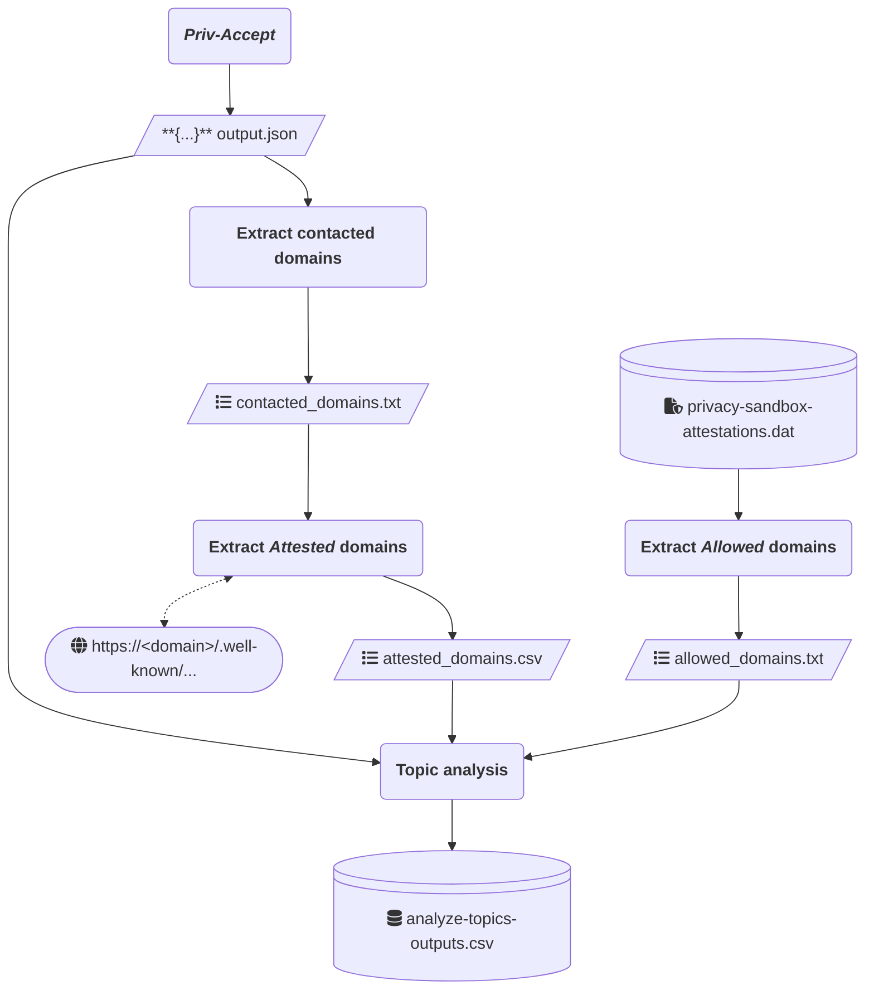

# Priv-Accept-Topics

An adaptation of the [*Priv-Accept*](https://github.com/marty90/priv-accept) web crawler, used to detect the usages of the Topics API.

## Repository structure

This repository consists of three main folders:
* The `crawler` folder contains the source code of the original *Priv-Accept* crawler, modified to allow the detection and recording of the Topics API usages.
* The `analyze-topics-api` folder contains tools developed to extract useful information from *Priv-Accept*'s outputs, in JSON format.
* `open-data` contains a clean dataset obtained during a single crawling performed on March 26th, 2024.

Each folder contains its relative README file, providing additional information.

Additionally, we provide the following files:
* `analyze-topics-complete.sh` is a single script that automates the entire measurement campaign.
* `chromium-changes.patch` contains the changes to be applied to Chromium's source code, if you wish to build it for yourself.

## Performing the measurements

We provide an automated bash script which performs the entire measurement campaign from a single machine. The tools used are the same present in this repository. The steps taken by the script and its outputs can be summarised in the following diagram:


### Prerequisites

The script is confirmed to work on a single machine running Ubuntu 22.04 LTS. The following packages are required:
* **Python** version 3.11.8 or higher, to execute the scripts. You can install the various dependencies with this command:
    ```shell
    pip install -r analyze-topics-api/requirements.txt
    ```
    It is not needed to install the dependencies for *Priv-Accept*, as the script executes it within a Docker container with all dependencies already installed.
* **Google Chrome** (unmodified), preferrably version 122.0.6261.128, to allow the extraction of the *Allowed* domain set.
* **Xvfb**, to allow the execution of Chrome under a virtual screen.
* **Docker**, to allow the execution of a containerized version of *Priv-Accept* with a pre-built version of the modified Chromium browser included.
* **GNU Parallel**, to allow the execution in parallel of multiple instances of the same step for different websites.
* **jq**, to compact multiple JSON outputs into a single CSV file.

### Running the script

Once the needed packages and dependencies are installed, you can simply execute the script:
```shell
bash analyze-topics-complete.sh

```
Keep in mind that the campaign is a lengthy and heavy process, which will use a large portion of the machine's CPU for an extended period of time. A 50,000-website crawl can last from 24 hours to several days, depending on the specs.

### Customizing `analyze-topics-complete.sh`'s behaviour

The beginning of the bash script contains the definitions of constants which can be modified to your liking:
* `WORKING_FOLDER`: where the root of the repository is located.
* `OUTPUTS_FOLDER`: where the *raw* outputs should be saved.
* `FINAL_OUTPUTS_FOLDER`: where the zipped final outputs should be saved.
* `CHROME_CONFIG_FOLDER`: where Chrome's local configuration folder is located.
* `WEBSITE_LIMIT`: how many websites to visit.
* `PRIV_ACCEPT_TIMEOUT`: how long to wait for *Priv-Accept* to produce an output relative to a single website before automatically killing its instance.

## Chromium modifications

If you wish to build your own customized version of Chromium with our modifications, we provide the `chromium-changes.patch` file. The patches shall be applied to the root of Chromium version 122.0.6261.128's source code.

## Open data

To allow reproducing our results, we provide the same dataset, plots and code used to generate them in the `open-data` folder.