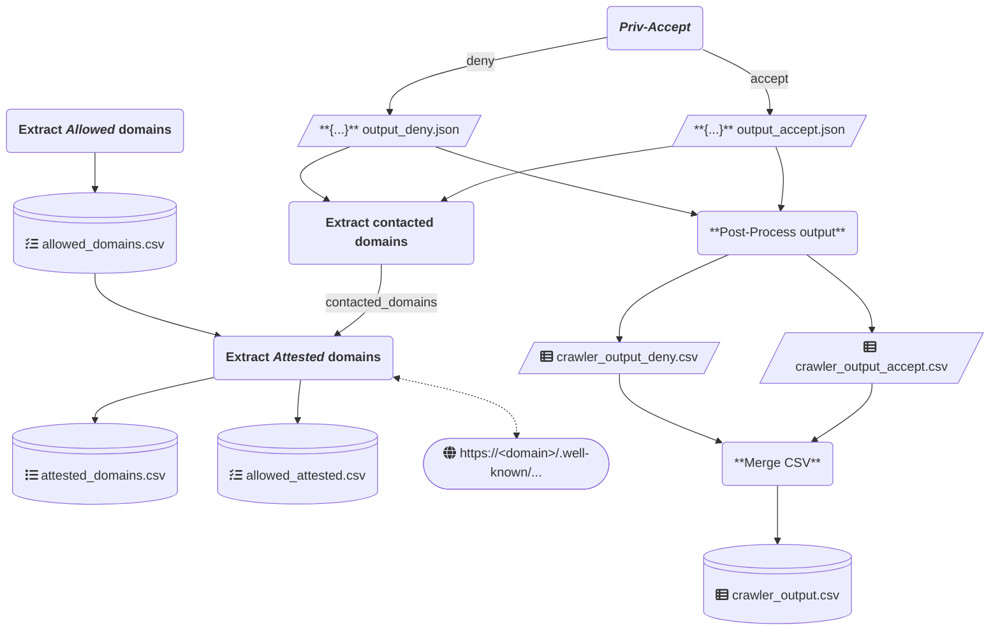

# Priv-Accept-PS

An adaptation of the [*Priv-Accept*](https://github.com/marty90/priv-accept) web crawler, extended to allow
* detection and automatic clicking of **"Deny" buttons** within privacy banners.
* monitoring the usage of most **Privacy Sandbox APIs**.

## Repository structure

This repository consists of four main folders:
* `extract-allowed` contains a script for downloading and extracting the domains of entities that are allowed to invoke the Privacy Sandbox APIs, according to Google.
* `crawler` contains the source code of the original *Priv-Accept* crawler, modified to allow the detection and recording of Privacy Sandbox usages.
* `post-process` contains tools for post-processing *Priv-Accept*'s output and extracting more useful information for compating the final output.
* `open-data` contains a clean dataset obtained during a single crawling performed on March 26th, 2024.

Each folder contains a README file that provides additional information. All tools are also pre-packaged into independent Docker containers.

Additionally, we provide the following files:
* `analyze-ps-complete.sh` is a script that automates the entire measurement campaign.
* `analyze-ps-single.sh` is a script that automates the analysis of a single website.

## Performing the complete measurements

The `analyze-ps-complete.sh` script performs the entire measurement campaign from a single machine. Since the script is mostly based on [GNU Parallel](https://www.gnu.org/software/parallel/), the script can be easily modified to support running the same commands on multiple machines, if needed. The tools used are the same present in this repository. The steps taken by the script and its outputs can be summarised in the following diagram:

```mermaid
flowchart TD
    PrivAccept("<b><i>Priv-Accept</i></b>") -- accept --> PAOutputAccept["**{...}** output_accept.json"]
    PrivAccept -- deny --> PAOutputDeny["**{...}** output_deny.json"]
    
    PAOutputAccept --> ExtractDomains("<b>Extract contacted domains</b>")
    PAOutputDeny --> ExtractDomains
    
    ExtractDomains -- contacted_domains --> AttestDomains("<b>Extract <i>Attested</i> domains</b>")
    AttestDomains --> ADOutput["fa:fa-list attested_domains.csv"]
    AttestDomains --> AAOutput["fa:fa-list-check allowed_attested.csv"]
    
    AttestDomains <-.-> WellKnown(["fa:fa-globe https://&lt;domain&gt;/.well-known/..."])
    
    ExtractAllowed("<b>Extract <i>Allowed</i> domains</b>") --> AllowedDomains["fa:fa-list-check allowed_domains.csv"] --> AttestDomains

    PAOutputAccept --> PostProcess("**Post-Process output**")
    PAOutputDeny --> PostProcess
    
    PostProcess --> PPOutputAccept["fa:fa-table-list crawler_output_accept.csv"]
    PostProcess --> PPOutputDeny["fa:fa-table-list crawler_output_deny.csv"]
    PPOutputAccept --> MergeCSV("**Merge CSV**")
    PPOutputDeny --> MergeCSV --> CrawlerOutput("fa:fa-table-list crawler_output.csv")

    PAOutputAccept@{shape: lean-r}
    PAOutputDeny@{shape: lean-r}
    ADOutput@{shape: disk}
    AAOutput@{shape: disk}
    PPOutputAccept@{shape: lean-r}
    PPOutputDeny@{shape: lean-r}
    AllowedDomains@{shape: disk}
    CrawlerOutput@{shape: disk}
```

**Note**: the file names with a "disk" shape in the diagram refer to the campaign's final outputs.

### Prerequisites

The script is confirmed to work on a single machine running Ubuntu 24.04 LTS with minimal requirements. The following packages are required:
* **Docker**, to allow the execution of a containerized version of *Priv-Accept* with a pre-built version of the modified Chromium browser included.
* **GNU Parallel**, to allow the execution in parallel of multiple instances of the same step for different websites.
* **zip** and **unzip**.

For machines running Ubuntu, we provide the `install-dependencies.sh` script. **Note**: Make sure to restart the machine after running it.

After installing the dependencies, the necessary Docker containers need to be built. To do this, you can run the `build.sh` script.

In summary, the easiest way to prepare an Ubuntu machine to run the campaign is the following:
* Run `install-dependencies.sh`
* Reboot the machine
* Run `build.sh`

### Running the script

Once the needed packages and dependencies are installed, you can simply execute the script:
```shell
bash analyze-ps-complete.sh
```
Keep in mind that the campaign is a lengthy and heavy process, which will use a large portion of the machine's CPU for an extended period of time. A 50,000-website crawl can last from 36 hours to several days, depending on the machine's specifications.

### Customizing `analyze-ps-complete.sh`'s behaviour

The beginning of the bash script contains the definitions of constants which can be modified to your liking:
* `WORKING_FOLDER`: where the root of the repository is located.
* `OUTPUTS_FOLDER`: where the *raw* outputs should be saved.
* `FINAL_OUTPUTS_FOLDER`: where the zipped final outputs should be saved.
* `CHROME_CONFIG_FOLDER`: where Chrome's local configuration folder is located.
* `WEBSITE_LIMIT`: how many websites to visit.
* `PRIV_ACCEPT_TIMEOUT`: how long to wait for *Priv-Accept* to produce an output relative to a single website before automatically killing its instance.
* `EXPRESSVPN_ACTIVATION_CODE`: ExpressVPN activation code used by the script. Replace the placeholder value in the script with your ExpressVPN activation code if you intend to run crawls through an ExpressVPN server; leave as the default placeholder to skip VPN usage.

### Script flags

The crawling script `analyze-ps-complete.sh` accepts several command-line flags to control its behaviour. Usage:
```
bash analyze-ps-complete.sh [-b <browser>] [-d <date>] [-l <lang>] [-r <remote_location>] [-t <timeout>] [-p <parallel_max>] [-w <websites>]
```
Flags:
- `-b <browser>`: Browser to use for the crawler (`chrome` or `firefox`. default: `chrome`).
- `-d <date>`: Date suffix to use for outputs (format YYYYMMDD). Defaults to today's date.
- `-l <lang>`: Comma-separated list of languages to pass to the browser (default: `en, en-us, en-gb, it, fr, es, de, ru`).
- `-r <remote_location>`: Label for a remote location / VPN server. When set, the outputs folder and some container names get a `-<remote_location>` suffix and an ExpressVPN container is started.
- `-t <timeout>`: Per-page timeout passed to the crawler (default: `5`).
- `-p <parallel_max>`: Maximum concurrent jobs for GNU Parallel (default: `0`).
- `-w <websites>`: How many websites to visit from the Tranco list (default: `10000`)

## Performing the measurements on a single website

For crawling a single website, we provide a pre-built Docker container with all dependencies already installed. The analysis can be run with the following command:
```shell
docker run [...docker_args]
    -v <local_output_dir>:/opt/priv-accept-ps/output
    query-privacy-sandbox-usage:latest <url> [--deny]
```
When the crawling is complete, the output folder will contain a `final-output.json` file, containing the most meaningful results.

This tool can be integrated within applications that provide on-demand data about cookie/Privacy Sandbox usage in Web pages.

## Open data

To allow reproducing our results, we provide the same dataset, plots and code used to generate them in the `open-data` folder.